## Содержание
1  [Введение](#anchor1)
1.1 [Назначение](#anchor2)
1.2 [Бизнес-требования](#anchor3)
1.2.1 [Исходные данные](#anchor4)
1.2.2 [Возможности бизнеса](#anchor10)
1.2.3 [Границы проекта](#anchor5)
2 [Требования пользователя](#anchor6)
2.1 [Программные интерфейсы](#anchor7)
2.2 [Интерфейс пользователя](#anchor8)
2.3 [Характеристики пользователей](#anchor9)
2.3.1 [Классы пользователей](#anchor11)
2.3.2 [Аудитория приложения](#anchor12)
2.3.2.1 [Целевая аудитория](#anchor13)
2.3.2.2 [Побочная аудитория](#anchor14)
2.4 [Предположения и зависимости](#anchor15)
3 [Системные требования](#anchor16)
3.1 [Функциональные требования](#anchor17)
3.1.1 [Основные требования](#anchor18)
3.1.1.1 [Вход пользователя в приложение](#anchor19)
3.1.1.2 [Настройка профиля активного пользователя](#anchor20)
3.1.1.3 [Загрузка товаров](#anchor21)
3.1.1.4 [Просмотр информации об отдельном товаре](#anchor22)
3.1.1.5 [Выход зарегистрированного пользователя из учетной записи](#anchor23)
3.1.1.6 [Регистрация нового пользователя после входа в приложение](#anchor24)
3.1.2 [Ограничения и исключения](#anchor25)
3.2 [Нефункциональные требования](#anchor26)
3.2.1 [Атрибуты качества](#anchor27)
3.2.1.1 [Требования к удобству использования](#anchor28)
3.2.1.2 [Требования к безопастности](#anchor29)
3.2.2 [Внешние интерфейсы](#anchor30)
3.2.3 [Ограничения](#anchor31)
4 [Глоссарий проекта](#anchor32)
5 [Создание модели вариантов использования](#anchor33)
6 [Создание диаграмм последовательности (Sequence Diagram)](#anchor34)
7 [Создание диаграмм кооперации](#anchor35)
8 [Создание диаграмм проектных классов](#anchor36)
9 [Создание диаграммы компонентов](#anchor37)
10 [Создание диаграммы размещения](#anchor38)
11 [Тестирование программного обеспечения](#anchor39)
11.1 [Объет тестирования](#anchor40)
11.2 [Риски](#anchor41)
11.3 [Аспекты тестирования](#anchor42)
11.4 [Подходы к тестированию](#anchor43)
11.5 [Представление результатов](#anchor44)
12 [Иллюстрации](#anchor45)
##1 Введение
###1.1 Назначение

   В этом документе описаны функциональные и нефункциональные требования к приложению «Интернет-магазин рыболовных принадлежностей» для ОС Windows 10. Этот документ предназначен для команды, которая будет реализовывать и проверять корректность работы приложения.

###1.2 Бизнес-требования

####1.2.1 Исходные данные

Мировой опыт показывает, что внедрение достижении информационных технологий является наиболее прогрессивным и экономически эффективным направлением в работе предприятий и организаций любой сферы деятельности, особенно это характерно для бухгалтерских систем.
Только применение информационных технологий - средств электронно-вычислительной техники (ЭВТ) - может дать необходимую, физически приемлемую скорость обработки таких объемов информации.
Ускоренный прогресс в информационных технологиях, который наблюдается в настоящее время, позволяет утверждать, что производительность и качество работы таких систем будут неуклонно повышаться при незначительном росте их стоимости.
Современные средства способны перевести работу сотрудников бухгалтерии на аналитический уровень, полностью рассматривая всю поступающую информацию и обеспечивая ее контроль. К таким средствам относятся СУБД, специализированное прикладное программное обеспечение, в частности "1С: Предприятие", занимающая лидирующую позицию на рынке такого рода продуктов и аппаратно-технические средства.
Поэтому для увеличения производительности труда отдела приема заявок и повышения эффективности обработки данных необходима разработка автоматизированной информационной системы, обеспечивающей автоматизацию задач по ведению отчетности о клиентах, ее сбору и учету, так как объемы циркулирующей в компании информации превосходят возможности сотрудников для ее обработки и анализа, а часть данных предоставлена на бумажных носителях и требует перевода в цифровую форму.
####1.2.2 Возможности бизнеса
Интерфейс, спроектированный с учётом всех особенностей данной возрастной категории, и дополнение приложения подробной инструкцией позволят увеличить количество людей, использующих данное приложение. Основную часть аудитории сети Интернет составляют люди, работающие в офисах и проводящие большую часть времени за компьютером. Как правило, их образ жизни не позволяет им тратить большое количество времени на походы по off-line магазинам в поисках именно того, что им нужно. Возможность заказать интересующий продукт в Интернете является для них действительно выходом из ситуации. Интернет существенно ограничивает возможности представления товара, поэтому подходит в большинстве случаев только для повторной покупки
####1.2.3 Границы проекта
Приложение «Интернет-магазин рыболовных принадлежностей» позволит зарегистрированным пользователям просматривать и приобретать рыболовные принадлежности, согласно их предпочтениям. Для анонимных пользователей предусмотрена возможность просмотра товаров.

##2 Требования пользователя
###2.1 Программные интерфейсы
Отображение товаров на страницах браузера.
###2.2 Интерфейс пользователя

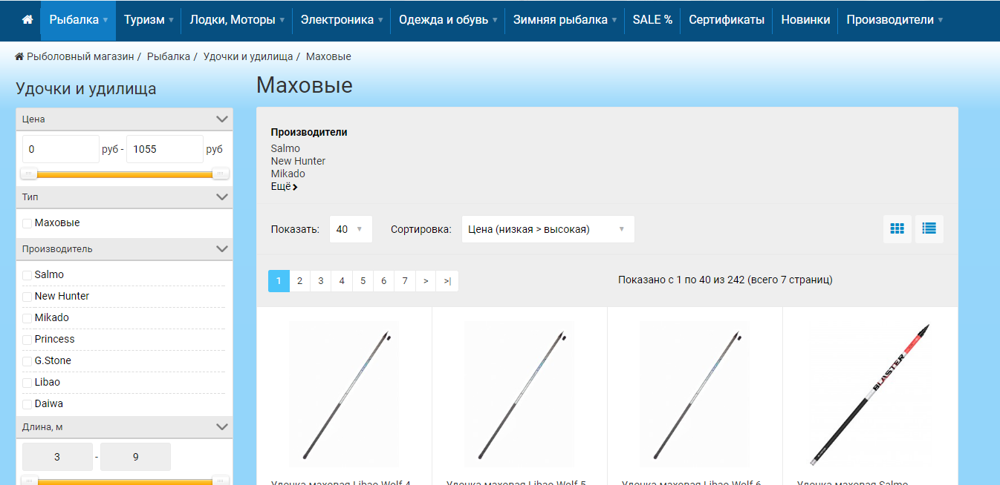

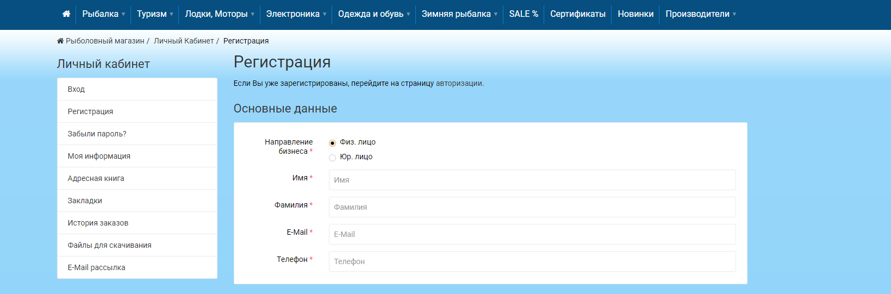

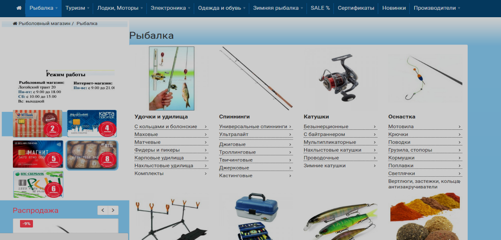

###2.3 Характеристики пользователей
####2.3.1 Классы пользователей
|Класс пользователей|Описание|
|-------------------|--------|
|Анонимные пользователи|Пользователи, которые не хотят регистрироваться в приложении. Имеют доступ к частичному функционалу|
|Зарегистрированные пользователи|Пользователи, которые вошли в приложение под своим именем (псевдонимом), желающие просматривать краткую информацию о новостях, отобранных согласно их предпочтениям. Имеют доступ к полному функционалу|

####2.3.2 Аудитория приложения
#####2.3.2.1 Целевая аудитория
Люди старшей возрастной категории со средним или выше среднего уровнем образования, обладающие минимальной технической грамотностью.
#####2.3.2.2 Побочная аудитория
Люди средней возрастной категории, обладающие вышеперечисленными качествами.

###2.4 Предположения и зависимости

	1.	Приложение не работает при отсутствии подключения к Интернету;
	2.	Приложение не обрабатывает данные БД, недоступных в момент запроса.

##3 Системные требования
###3.1 Функциональные требования
####3.1.1 Основные функции
#####3.1.1.1 Вход пользователя в приложение
Описание. Пользователь имеет возможность использовать приложение без создания собственного профиля либо войдя в свою учётную запись.

|Функция|Требования|
|-------|----------|
|Вход в приложение без создания собственного профиля|Приложение должно предоставить пользователю возможность войти в приложение анонимно|
|Регистрация нового пользователя|Приложение должно запросить у пользователя ввести имя для создания учётной записи. Пользователь должен либо ввести имя, либо отменить действие|
|Пользователь с таким именем существует|Приложение должно известить пользователя об ошибке регистрации и запросить ввод псевдонима. Пользователь должен либо ввести псевдоним, либо отменить действие|
|Вход зарегистрированного пользователя в приложение|Приложение должно предоставить пользователю список имён (псевдонимов) зарегистрированных пользователей. Пользователь должен либо выбрать из списка своё имя (псевдоним), либо отменить действие|
#####3.1.1.2 Настройка профиля активного пользователя
Описание. Зарегистрированный пользователь имеет возможность редактировать список ссылок на интернет-ресурсы, с которых производится выборка товаров, и списки (включений и исключений) ключевых фраз для фильтрации товаров.

|Функция	|Требования|
|-----------|----------|
|Добавление товаров|Приложение должно предоставить администратору поля для ввода параметров товаров. Администратор должен либо ввести параметры и подтвердить действие, либо отменить его|
|Удаление товаров|Администратор имеет возможносность выделить товар в списке и удалить его|
|Добавление избранных товаров|Приложение должно предоставить зарегистрированному пользователю возможность выбрать список, в который будет добавлен товар, и поле для её ввода.|
#####3.1.1.3 Загрузка товаров
Описание. После входа администратора необходимо загрузить информацию о товарах и отфильтровать их согласно спискам ключевых фраз.

|Функция|Требования|
|-------|----------|
|Загрузка информации о товарах|Приложение должно загрузить информацию о товарах после входа администратора в приложение.|
|Фильтрация товаров|Приложение должно отфильтровать товары согласно спискам ключевых фраз|
#####3.1.1.4 Просмотр информации об отдельном товаре
Описание. Пользователь имеет возможность просмотреть информацию о каждом товаре, представленной в таблице.

|Функция|Требования|
|-------|----------|
|Просмотр краткой информации|Пользователь имеет возможность выбрать товар в таблице одинарным кликом по ней. Сайт должен отобразить его заголовок, описание и дату размещения.|
|Просмотр подробной информации|Пользователь имеет возможность выбрать товар в таблице двойным кликом по ней. Приложение должно открыть полную версию страницы в браузере, установленном в системе по умолчанию|
#####3.1.1.5 Выход зарегистрированного пользователя из учётной записи
Описание. Зарегистрированный пользователь имеет возможность выйти из учётной записи.
Требование. Приложение должно предоставить зарегистрированному пользователю возможность выйти из учётной записи с возвратом к окну входа в приложение.
#####3.1.1.6 Регистрация нового пользователя после входа в приложение
Описание. Анонимный пользователь имеет возможность зарегистрироваться в приложении.
Требование. Приложение должно предоставить анонимному пользователю возможность.

####3.1.2 Ограничения и исключения

Приложение работает только при наличии подключения к Интернету;
##3.2 Нефункциональные требования
####3.2.1 Атрибуты качества
#####3.2.1.1 Требования к удобству использования
* Доступ к основным функциям приложения не более чем за две операции;
*	Все функциональные элементы пользовательского интерфейса имеют названия, описывающие действие, которое произойдет при выборе элемента;
*	Пошаговая инструкция использования основных функций приложения отображена в справке.

##### 3.2.1.2 Требования к безопасности
Приложение предоставляет возможность просмотра и редактирования профиля только активного пользователя.
####3.2.2 Внешние интерфейсы
Окна приложения удобны для использования пользователями с плохим зрением:
	•	размер шрифта не менее 12пт;
	•	функциональные элементы контрастны фону окна.
####3.2.3 Ограничения
	1.	Приложение реализовано на платформе JAVA SPRING;
	2.	Профиль пользователя хранится в файле с расширением XML, название файла совпадает с именем (псевдонимом).

##4 Глоссарий проекта

Менеджер - человек, работающий с системой торговой фирмы, сотрудник фирмы.
Клиент- человек или организация, желающий(ая) оформить заказ на ряд продукции по прайсу.
Товар - позиция прайс-листа, товар, имеющийся в наличии или под заказ, который фирмы может поставить.
Заказ - совокупность сведений о товарах, клиенте, оплате, хранящаяся в БД системы и отражающая одну конкретную операцию продажи ряда товаров клиенту.

##5 Создание модели вариантов использования

В результате анализа технического задания была составлена следующая диаграмма прецедентов рис. 1.

Описание прецедента «Оформление заказа»
Краткое описание
Вариант использования позволяет клиенту оформить заказ на поставку ряда товаров (не менее одного товара) в соответствии с каталогом (прайс-листом) и сохранить сведения о нем в БД системы.
Предусловия
Перед выполнением этого варианта использования необходимо чтобы были известны исходные данные о товаре (название, производитель, стоимость) и клиенте (имя, телефон, адрес).
Основной поток событий
Вариант использования начинается, когда клиент выбирает пункт меню на сайте «Оформить заказ» или отправляет список продукции по e-mail менеджеру и это действие фиксируется в БД.
Клиент (или сотрудник, если заказ прислан по e-mail) вводит информацию о заказе в поля формы.
Система автоматически присваивает идентификационный номер заказу.
На этом этапе могут возникнуть ошибки формата ввода в поля формы «Оформление заказа», при этом выполняется альтернативный поток событий А1.
По запросу менеджера система сохраняет в БД информацию о клиенте.
Вариант использования завершается.
Альтернативный поток событий А1. Ошибки формата ввода в поля формы «Оформление заказа»
Система выдает предупреждающее сообщение пользователю.
В случае исправления ошибок ввода пользователем, система переходит к п.5 основного потока.
Вариант использования завершается.
Постусловия
Если вариант использования выполнен успешно, то сведения о новом заказе будут сохранены в БД.
В противном случае состояние системы не изменится.
Описание прецедента «Регистрация клиента»
Краткое описание
Вариант использования позволяет сотруднику торговой фирмы зарегистрировать нового клиента и сохранить сведения о нем в БД системы или же с помощью Интернет новому пользователю самостоятельно зарегистрироваться в системе, как клиенту.
Предусловия
Перед выполнением этого варианта использования необходимо чтобы была известна информация о клиенте (ФИО и телефон).
Основной поток событий
Вариант использования начинается, когда сотрудник (пользователь) оформляет новый заказ («Оформление заказа») на поставку товара и такого клиента в БД не существует.
Сотрудник (пользователь) вводит информацию о клиенте (ФИО, адрес и номер телефона).
Система автоматически присваивает идентификационный номер клиенту.
Система по запросу пользователя осуществляет сохранение сведений о новом клиенте в БД.
На этом этапе могут возникнуть ошибки формата ввода в поля формы «Оформление заказа», при этом выполняется альтернативный поток событий А1.
Вариант использования завершается.
Альтернативный поток событий А1. Ошибка формата ввода в поля формы «Оформление заказа»
Система выдает предупреждающее сообщение пользователю.
В случае исправления ошибок ввода пользователем, система переходит к п.4 основного потока событий.
Вариант использования завершается.
Постусловия
Если вариант использования выполнен успешно, то сведения о новом клиенте будут сохранены в БД.
В противном случае состояние системы не изменится.
Описание прецедента «Проведение заказа»
Краткое описание
Вариант использования позволяет сотруднику торговой компании провести выполнение заказа клиента на товары.
Предусловия
Перед выполнением этого варианта использования необходимо чтобы была сформирована БД со сведениями о заказах, клиентах и товарах.
Основной поток событий
Вариант использования начинается, когда менеджер выбирает пункт меню программы «Принять заказ».
Сотрудник выбирает подпункт меню «Ввести данные для оплаты» или «Подобрать транспортную компанию».
Сотрудник указывает данные по оплате (реквизиты, сумма) и/или данные о транспортной компании.
На этом этапе могут возникнуть ошибки формата ввода в поля формы «Информация об оплате», при этом выполняется альтернативный поток событий А1.
Менеджер указывает дату отгрузки заказа.
Менеджер отправляет заказ клиенту для оплаты;
Клиент оплачивает заказ (если заказ через интернет, то оплата проходит через платежный терминал и информация сохраняется в БД, в противном случае менеджер вручную вносит информацию по оплате заказа в БД на основании платежных документов).
На этом этапе могут возникнуть ошибки ввода данных на форме «Оплата заказа», при этом выполняется альтернативный поток событий А2.
Выполняется отгрузка заказа и заказ переводится на стадию «Отгружен».
После получения заказа клиентом, клиент уведомляет об этом торговую компанию, и заказ в БД помечается завершенным.
Вариант использования завершается.
Альтернативный поток событий А1. Ошибка формата ввода в поля формы «Информация об оплате»
Система выдает предупреждающее сообщение пользователю.
В случае исправления ошибок ввода пользователем, система переходит к п.4 основного потока событий.
Вариант использования завершается.
Альтернативный поток событий А2. Ошибка формата ввода в поля формы «Оплата заказа»
Система выдает предупреждающее сообщение пользователю.
В случае исправления ошибок ввода пользователем, система переходит к п.7 основного потока событий.
Вариант использования завершается.
Постусловия
Если вариант использования выполнен успешно, то информация по запросу будет обновлена в БД и статус заказа изменится.
В противном случае состояние системы не изменится.
Описание прецедента «Публикация каталога»
Краткое описание
Вариант использования «Публикация каталога» позволяет менеджеру торговой компании опубликовать обновленный каталог товаров (прайс-лист) на основании выборки данных из БД.
Предусловия
Перед выполнением этого варианта использования необходимо чтобы в БД была информация хотя бы по одному товару, имеющемуся в наличии.
Основной поток событий
Вариант использования начинается, когда менеджер выбирает пункт меню в программе «Опубликовать каталог».
Менеджер вводит данные для выборки товаров (производитель, название и т.д.) и нажимает «Выбрать».
На этом этапе могут возникнуть ошибки ввода и обработки данных, при этом выполняется альтернативный поток А1.
Система по запросу менеджера выполняет поиск данных и возвращает список менеджеру.
На этом этапе может возникнуть ошибка отсутствия результатов, при этом выполняется альтернативный поток А2.
Менеджер, ознакомившись с результатом выборки, нажимает «Опубликовать каталог».
Вариант использования завершается.
Альтернативный поток событий А1. Ошибка ввода и обработки данных.
Система выдает предупреждающее сообщение менеджеру.
В случае исправления ошибок ввода сотрудником, система переходит к п.3 основного потока событий.
Вариант использования завершается.
Альтернативный поток событий А2. Система не может вернуть результат запроса.
Система выдает предупреждающее сообщение менеджеру.
В случае исправления ошибок сотрудником, система переходит к п.4 основного потока событий.
Вариант использования завершается.
Постусловия
Если вариант использования выполнен успешно, то на сайте компании будет опубликован обновленный каталог, кроме того PDF файл каталога будет сохранен на сервере.
В противном случае состояние системы не изменится.
Описание прецедента «Возврат заказа»
Краткое описание
Вариант использования «Возврат заказа» позволяет менеджеру/клиенты оформить возврат товара по определенному заказу в случае, если товар пришел ненадлежащего качества.
Предусловия
Перед выполнением этого варианта использования необходимо чтобы клиент уведомил менеджера торговой фирмы о желании оформить возврат заказа и отправил полученный товар обратно транспортной компанией. Также должен быть известен идентификационный номер заказа.
Основной поток событий
Вариант использования начинается, когда менеджер (или клиент, если заказ оформлен через интернет) выбирает пункт меню программы «Оформить возврат заказа».
1 Клиент подтверждает возврат заказа с указанием «полный» или «частичный».
Менеджер вносит идентификационный номер заказа в форму «Возврат заказа».
Система выводит список товаров по заказу из которого менеджер отмечает возвращаемые.
Система формирует данные для отправки заказа в торговую компанию и менеджер отправляет эти данные клиенту.
Менеджер отмечает получение возвращаемого товара.
В случае, если товар получен, менеджер осуществляет возврат денежных средств клиенту.
Менеджер переводит возвращенный товар на стадию «в обработке».
Система осуществляет сохранение сведений о заказе и товаре в БД.
Вариант использования завершается.
Постусловия
Если вариант использования выполнен успешно, то сведения о возврате заказа будут сохранены в БД, статус возвращенных товаров изменится на «в обработке». Данные товары отправятся на проверку качества и в случае определения брака, товары будут списаны. Клиенту осуществляется возврат средств.
В противном случае состояние системы не изменится.
Описание прецедента «Формирование отчетов»
Краткое описание
Вариант использования позволяет менеджеру сформировать все основные отчеты по деятельности компании.
Предусловия
Перед выполнением этого варианта использования необходимо, чтобы БД содержала сведения о товарах и заказах, а также документах оплаты заказов.
Основной поток событий
Вариант использования начинается, когда менеджер выбирает соответствующий пункт меню программы.
Система по запросу клиента выбирает из БД все необходимые данные (заказы за период, поступления на основании оплаты заказов, товары «в наличии»).
В случае отсутствия запрашиваемых данных система выдает соответствующее сообщение и система переходит к п.5
Вариант использования завершается.
Постусловия
Если вариант использования выполнен успешно, то будет сформирован текстовый документ - отчет по товарам/заказам/оплатам.
В противном случае состояние системы не изменится.
Создание классов анализа, участвующих в реализации вариантов использования
##6 Создание диаграмм последовательности (Sequence Diagram)

В ходе разработки диаграмм последовательности помимо вышеперечисленных классов добавились новые, в частности классы входных форм, классы работы с БД, а также классы, обеспечивающие выполнение основных программных функций.

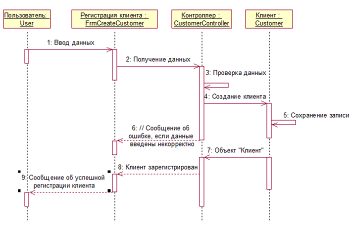
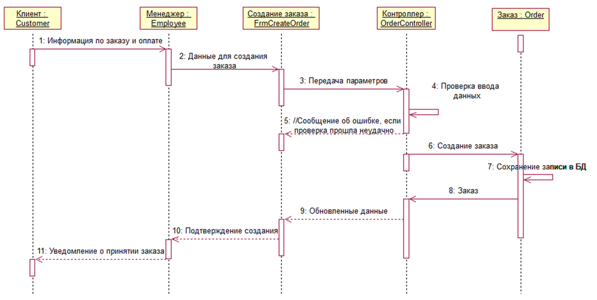
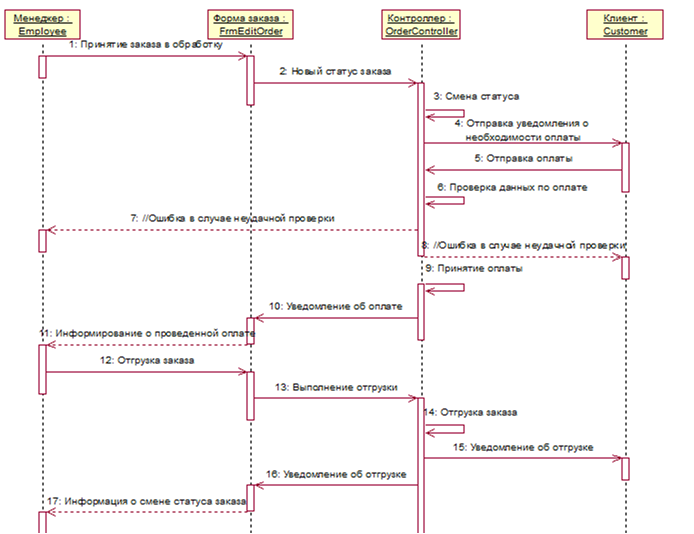
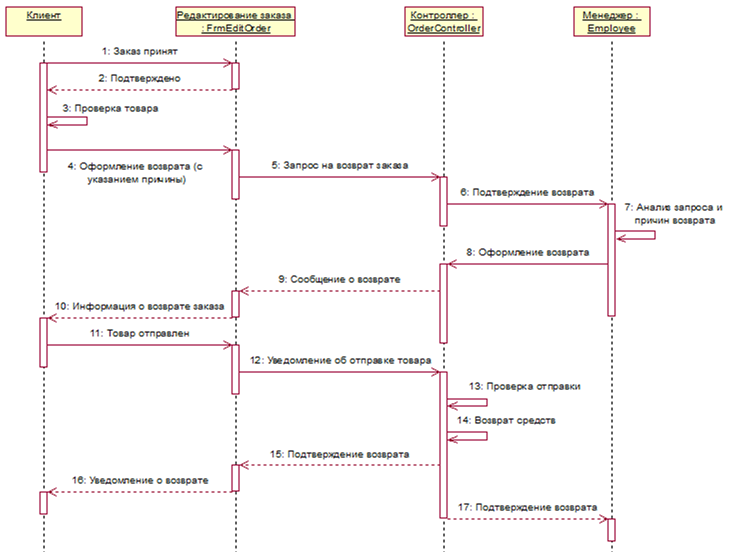
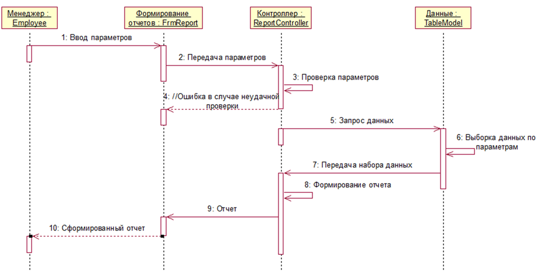

##7 Создание диаграмм кооперации

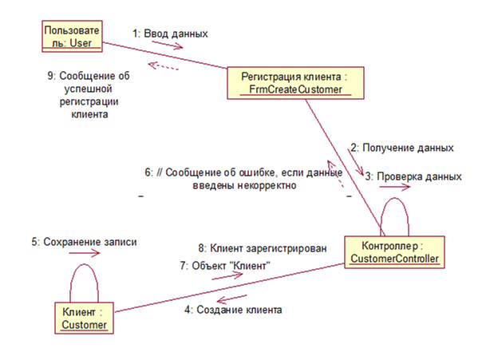

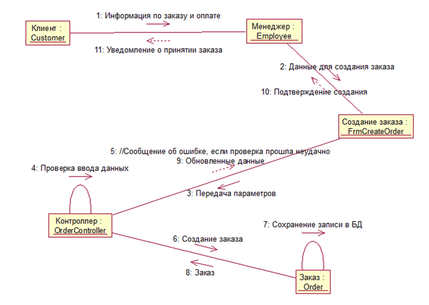

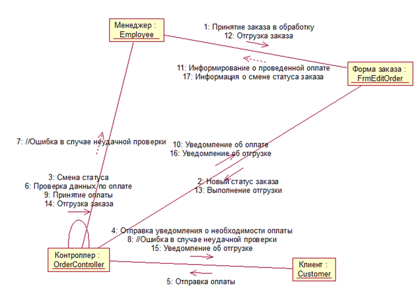

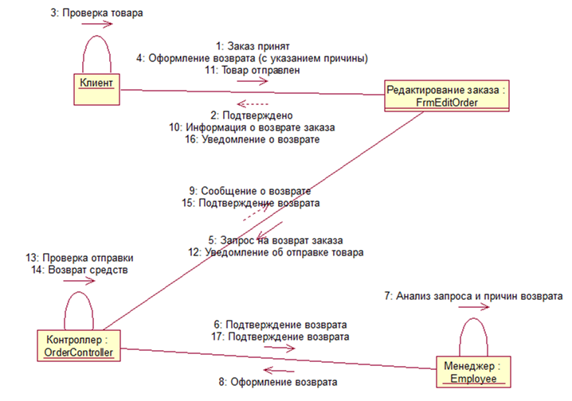

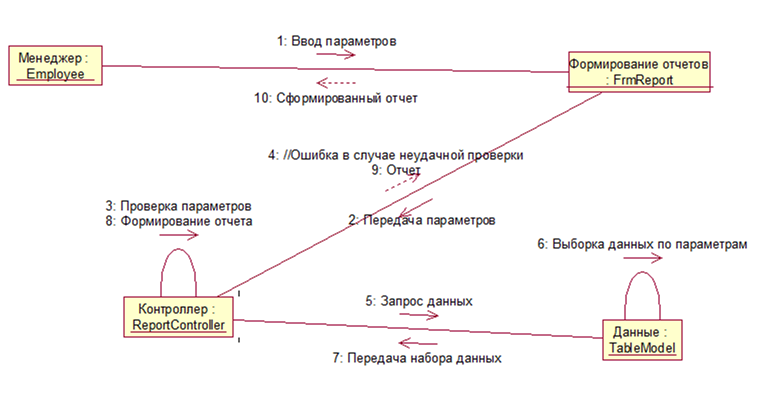

##8 Создание диаграмм проектных классов

Создание диаграмм проектных классов, описывающих реализацию вариантов использования.
На основе анализа диаграмм взаимодействия, построим диаграммы классов, описывающих реализацию вариантов использования рис. 13-16.

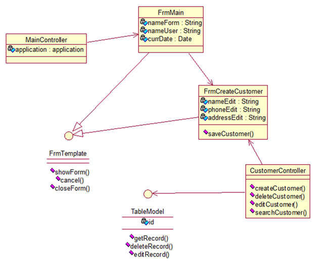

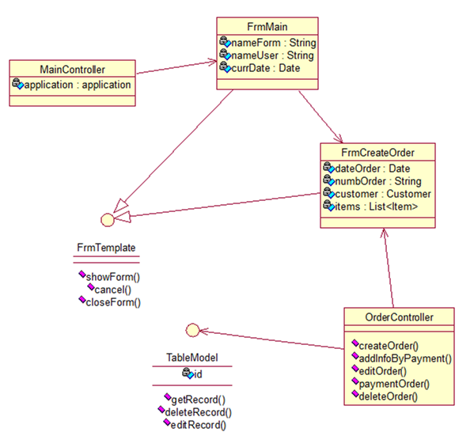

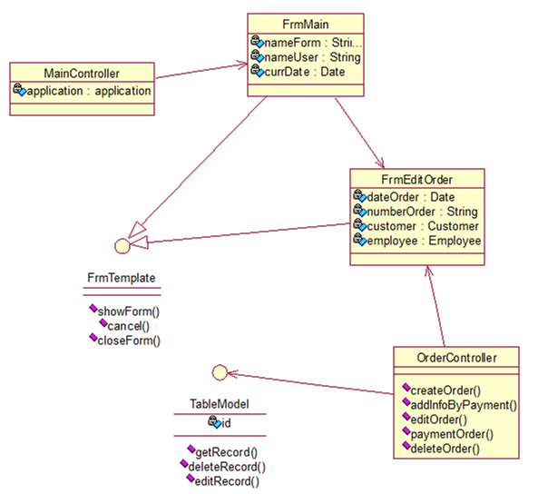

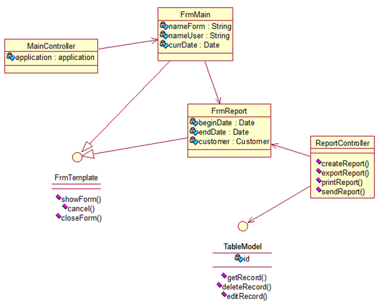

Главная диаграмма проектных классов для всей системы представлена на рис. 16.

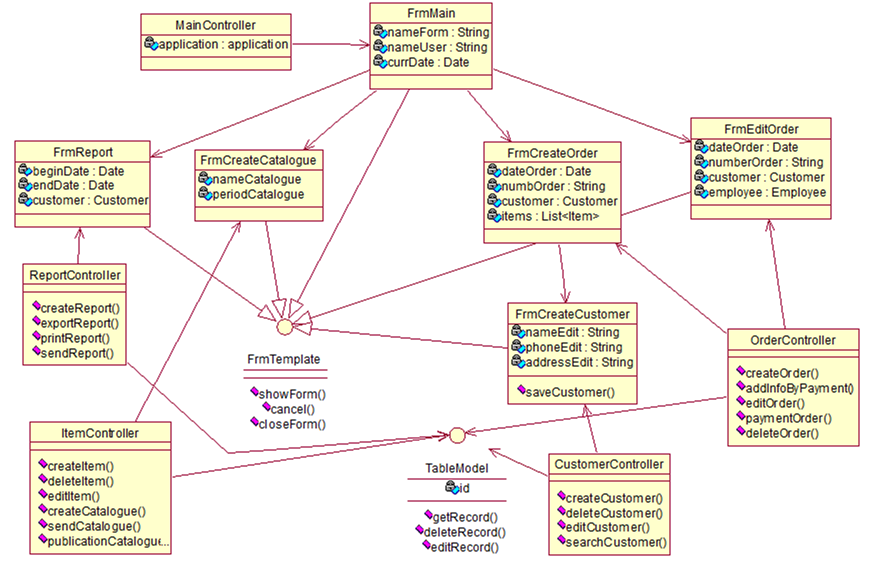

Описание классов см. табл. 1

Таблица 1- Описание классов системы

|Название|Описание|
|--------|--------|
|frmMain Главная форма|Описание Является основным окном программы. Обязанности: - создавать и показывать вызываемые пользователем окна программы.|
|FrmCreateCustomer, FrmReport, FrmCreateCatalogue, FrmCreateOrder, FrmEditOrder Основные формы программы|Описание Набор форм представляющих собой пользовательский интерфейс. Являются потомками класса FrmMain (базовый класс в иерархии форм данного проекта). Обязанности: -позволяет вводит входные данные по всем ключевым объектам система (создавать и редактировать информацию в БД). Класс FrmReport позволяет также генерировать и сохранять отчеты в системе.|
|MainController Контроллер главной формы|Описание: Класс предназначен для запуска и управления приложением Обязанности: - осуществлять запуск приложения; - осуществлять вызов форм приложения.|
|ReportController Контроллер модуля отчетности|Описание: Класс предназначен для генерации отчетов на основании данных из БД. Обязанности: - осуществлять выборку данных на основании заданных параметров; - формировать экранную форму отчета с выводом на печать.|
|ItemController Контроллер модуля «Товары» (для формы «Публикация каталога»)|Описание: Класс предназначен для управления информацией о товарах. Обязанности: - осуществлять создание/редактирование/удаление товаров; - осуществлять публикацию каталога; - осуществлять рассылку каталога.|
|CustomerController Контроллер модуля «Клиенты» (для формы «Регистрация клиента»)|Описание: Класс предназначен для оформления нового заказа клиента. Обязанности: - осуществлять проверку данных о заказе; -рассчитывать стоимость заказа; -сохранять сведения о заказе в БД; -формировать отчет о заказе для вывода на печать.|
|OrderController Контроллер заказов (для форм создания и редактирования заказов)|Описание: Класс предназначен для оформления и проведения заказов, а также их возврата клиентом. Обязанности: - обрабатывать запросы и выводить данные о заказах; - обрабатывать запросы и создавать/изменять информацию о заказах.|
|TableModel Базовый невизуальный класс, предназначенный для работы программы с таблицами БД.|Описание: Позволяет осуществлять взаимодействие программного приложения и таблицы БД.|

##9 Создание диаграммы компонентов

На рис. 18 показана диаграмма компонентов всей системы.

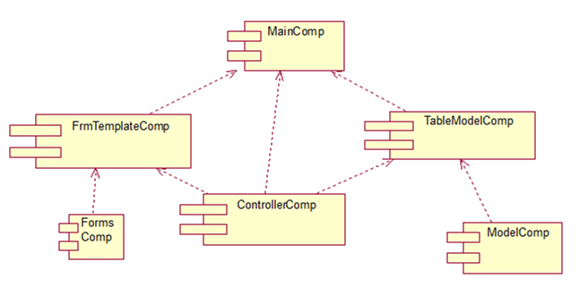

##10 Создание диаграммы размещения

Диаграмма размещения отражает физические взаимосвязи между программными и аппаратными компонентами системы. На рис. 19 представлена диаграмма размещения для системы торговой компании.

##11 Тестирование программного обеспечения 
###11.1 Объект тестирования

В процессе тестирования предполагается проверить работоспособность приложения.
В качестве объектов тестирования можно выделить основные функциональные требования, а также требования удобству использования.
Атрибуты качества:
1.	Функциональная пригодность
	-	Функциональная полнота.
	-	Функциональная корректность.
	-	Функциональная целесообразность.
2.	Удобство использования.
	-	Определимость пригодности.
	-	Изучаемость.
	-	Управляемость.
	-	Защищённость от ошибки пользователя.
	-	Эстетика пользовательского интерфейса.

###11.2 Риски

К рискам можно отнести:
*	низкая скорость подключения к интернету;
*	недоступность одного из интернет-ресурсов, выбранных пользователем;
*	ввод пользователем url-адреса, который не является rss-ресурсом.

###11.3 Аспекты тестирования

В ходе тестирования планируется проверить реализацию основных функций приложения, а также удобство использования.
      К основным функциям можно отнести следующие пункты:
*	загрузка товаров;
*	фильтрация товаров;
*	просмотр сведений об отдельном товаре (краткая/подробная информация);
*	настройка и сохранение профиля пользователя.
Функции регистрации и входа в приложение не выносятся на тестирование, так как они являются побочными функциями приложения.

###11.4 Подходы к тестированию
Предполагается использовать ручное тестирование.
###11.5 Представление результатов
</li>
Таблица 5.1 – Функциональные тест-кейсы

|Модуль|Подмодуль/экран|Описание теста|Ожидаемый результат|Статус|
|-------|-------|------|------|------|
|Программное средство|Главная страница|Авторизация пользователя:	перейти на главную форму,	ввести логин пользователя, ввести пароль,	нажать на кнопку меню «Вход»|	Появляется форма программы, появляется форма для заполнения с полями, «Логин», «Пароль»,	в поле «Пароль» введён пароль пользователя,	в поле «Логин» введён логин.|Выполнено успешно
|Программное средство|Наименование товаров|Добавление нового товара:	перейти на главную форму программного средства,	нажать на кнопку меню «Наименование товаров»,	заполнить поля, нажать на кнопку «Сохранить»|	Появляется форма,	открывается список,	выводится форма в виде списка товаров,	отображается форма со списком товаров|Выполнено успешно|
|Программное средство|Поставщики|Добавление нового поставщика:	перейти на главную форму программного средства,	нажать на кнопку меню «Поставщики»,	заполнить поля,	нажать на кнопку «Сохранить»|	Появляется форма,	открывается список,	выводится форма в виде списка поставщиков,	отображается форма со списком поставщиков|Выполнено успешно|
|Программное средство|Удаление товара|Удаление товара (предварительное условие: функция доступна только для пользователей с уровнем доступа «Administrator»):	выбор строки,	нажать иконку удаление товара (кнопка),	в форме подтверждения удаления нажать кнопку «Удалить»|	Вывод формы в виде списка товара,	вывод формы, подтверждающей удаление с информацией о удаляемом товаре,	вывод формы в виде списка товара|Выполнено успешно
|Программное средство|Удаление клиента|Предварительное условие: функция доступна только для пользователей с уровнем доступа «Administrator», выбор строки,	нажать иконку удаление клиента (кнопка),в форме подтверждения удаления нажать соответственно кнопку| Вывод формы в виде списка клиента,	вывод формы подтверждающей удаление с информацией о удаляемом клиенте,	вывод формы в виде списка клиентов|Выполнено успешно|

##12 Иллюстрации
Главная страница.
